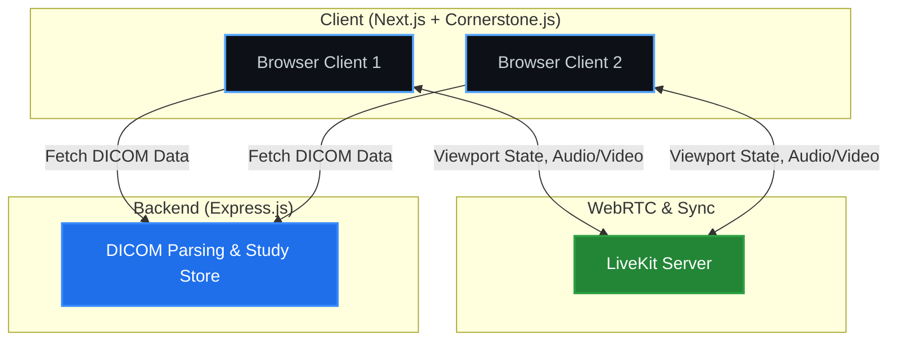

<p align="center">
  
</p>

# VoxelSync 🧠✨

**VoxelSync** is a modern, real-time medical imaging collaboration platform built with Next.js, LiveKit, and Cornerstone.js. It enables medical professionals to view, interact with, and synchronize DICOM medical images across multiple clients in real-time, empowering collaborative diagnostics and remote consultations.

## 🚀 Key Features

*   **Real-time Collaboration**: Synchronizes viewport state (pan, zoom, scroll, window levels) across all connected clients instantly.
*   **WebRTC Powered**: Utilizes LiveKit for ultra-low latency data channels and optional voice/video communication.
*   **Performant Rendering**: Uses Cornerstone.js for professional-grade, browser-based DICOM parsing and rendering.
*   **Monorepo Architecture**: Cleanly separated packages using npm workspaces for scalable development.

## 📐 Architecture

VoxelSync follows a modern monorepo structure, dividing the stack into a robust Express server for DICOM handling and a reactive Next.js client for rendering and LiveKit synchronization.



## 📂 Project Structure

```
VoxelSync/
├── apps/
│   ├── web/           # Next.js frontend app (Cornerstone + LiveKit UI)
│   └── server/        # Express.js backend (DICOM parsing worker)
├── packages/
│   └── types/         # Shared Zod schemas and TS definitions
├── docker-compose.yml # Dev environment for LiveKit and Redis
└── livekit.yaml       # LiveKit server configuration
```

## 🛠️ Tech Stack

*   **Frontend:** [Next.js](https://nextjs.org) (App Router), React, Tailwind CSS
*   **Imaging:** [Cornerstone.js](https://www.cornerstonejs.org) for rendering, `dicom-parser` for parsing.
*   **Real-time Sync:** [LiveKit](https://livekit.io) (DataChannels & WebRTC)
*   **Backend:** Node.js, [Express](https://expressjs.com)
*   **Types & Validation:** TypeScript, [Zod](https://zod.dev)

## 🏁 Getting Started

### Prerequisites

Ensure you have the following installed:
*   [Node.js](https://nodejs.org/) (v20+)
*   [npm](https://www.npmjs.com/)
*   [Docker Desktop](https://www.docker.com/products/docker-desktop/) (for LiveKit server)

### 1. Start the LiveKit Server

Run the local LiveKit instance using Docker Compose:

```bash
docker-compose up -d
```

### 2. Install Dependencies

Install the packages across the monorepo:

```bash
npm install
```

### 3. Run the Development Server

Start both the frontend and backend simultaneously:

```bash
npm run dev
```

The application will be available at:
*   Frontend: `http://localhost:3000`
*   Backend API: `http://localhost:4000`

## 🤝 Contributing

Contributions are welcome! Please feel free to submit a Pull Request.

## 📄 License

This project is licensed under the MIT License.
